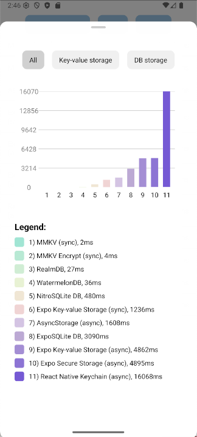

# React Native Storage Benchmark (Updated August 2025)

This project is an updated performance benchmark of popular storage solutions in the React Native ecosystem. This is an Expo SDK 53 (with React Native 0.79) App reproducer to demonstrate the performance difference between the libraries.

The work is based on the benchmark from [mrousavy/StorageBenchmark](https://github.com/mrousavy/StorageBenchmark).

### ***Note: Test scores may vary between different machines with different hardware.***

## Benchmark Setup

The tests were conducted with the following configuration:

*   **Device:** Samsung Galaxy A56
*   **Framework:** Expo SDK 53 (React Native 0.79)
*   **Build Command:** `npx expo run:android --variant=release`
*   **Test Scenario:** Calling a `get` operation (retrieve one value from the database) a thousand times.
*   **Methodology:** Each library's test was executed multiple times, and the average execution time was recorded.

It's important to note that this is a **basic** stress test. When using other operations (e.g., set, update, delete) or as your project's complexity grows, the performance measurements may vary.

## Libraries Tested

The following libraries were included in this benchmark:

*   MMKV
*   MMKV Encrypt
*   RealmDB
*   WatermelonDB
*   NitroSQLite DB
*   Expo Key-value Storage
*   AsyncStorage
*   ExpoSQLite DB
*   Expo Secure Storage
*   React Native Keychain

## Performance Results

The table below shows the average time taken to perform 1000 read operations for each library, sorted from fastest to slowest.

| Rank | Library | Average Time (ms) |
| :--- | :--- | :--- |
| 1 | MMKV | **2 ms** |
| 2 | MMKV Encrypt | **4 ms** |
| 3 | RealmDB | **27 ms** |
| 4 | WatermelonDB | **36 ms** |
| 5 | NitroSQLite DB | **480 ms** |
| 6 | Expo Key-value Storage | **1236 ms** |
| 7 | AsyncStorage | **1608 ms** |
| 8 | ExpoSQLite DB | **3090 ms** |
| 9 | Expo Secure Storage | **4895 ms** |
| 10 | React Native Keychain | **16068 ms** |

## Conclusion

The 2025 benchmark shows that for fast read operations, **MMKV** is the absolute leader, demonstrating exceptional performance. Even its encrypted version (`MMKV Encrypt`) significantly outperforms all other solutions.

Libraries like `RealmDB` and `WatermelonDB` also show high performance and are excellent choices for complex databases.

Solutions that rely on native secure storage mechanisms, such as `Expo Secure Storage` and `React Native Keychain`, exhibit much higher latencies due to the additional security overhead, making them less suitable for frequently accessed data.

## Credits

*   **Original Benchmark:** [Marc Rousavy (mrousavy/StorageBenchmark)](https://github.com/mrousavy/StorageBenchmark)

Feel free to fork this repo with improvements or to include other storage libraries.